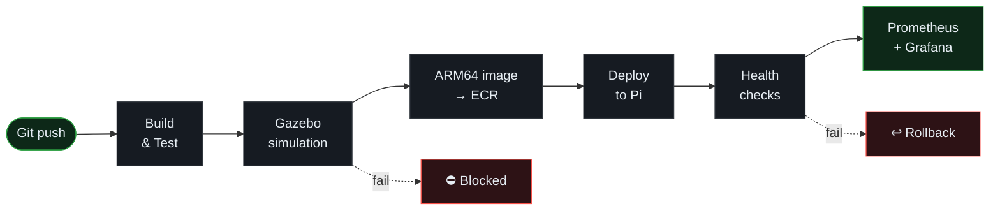

<div align="center">

# ros2-sre-pipeline

**A CI/CD pipeline for ROS 2 that treats reliability as something you measure, not something you claim.**

From a Git commit to a real robot, with every step tested, observed and reversible.

<br>


<br><br>


<br><br>

[What](#-what-is-this) · [Pipeline](#-the-pipeline) · [Metrics](#-what-i-measure) · [Decisions](#-design-decisions) · [Roadmap](#-roadmap) · [Run it](#-run-it) · [Structure](#-repository-structure)

</div>

<br>

# 🎯 What is this?

A CI/CD pipeline that takes a ROS 2 change from a Git commit to a real robot (Raspberry Pi). Every change is built, tested and simulated in Gazebo before an ARM64 image is deployed, and health checks decide whether it stays or gets rolled back. Reliability is measured by injecting faults on purpose.

<table align="center">
  <tr>
    <td align="center" width="33%">
      <h3>🚦</h3>
      <b>Earn the deploy</b><br><br>
      A change has to pass every gate before it reaches the hardware.
    </td>
    <td align="center" width="33%">
      <h3>↩️</h3>
      <b>Recover on its own</b><br><br>
      A bad deploy is caught and rolled back without me touching the robot.
    </td>
    <td align="center" width="33%">
      <h3>📈</h3>
      <b>Numbers, not feelings</b><br><br>
      Detection and recovery times are measured, not guessed.
    </td>
  </tr>
</table>

<br>

# 🔄 The pipeline



<br>

# 📊 What I measure

I don't want to say the system is "reliable" without evidence, so these are the numbers I track:

| Metric | What it tells me |
| :-- | :-- |
| **MTTD** (Mean Time To Detect) | How long a failure lives before something notices it |
| **MTTR** (Mean Time To Recover) | How long it takes to get back to a healthy state |
| **Deployment failure rate** | Percentage of deployments that fail runtime validation |

To get meaningful data, I inject faults on purpose (killed nodes, bad configs, broken releases) and record how the pipeline responds. Results will be published here once the experiments are done.

<br>

# 🧠 Design decisions

<table align="center">
  <tr>
    <td width="50%" valign="top">
      <b>🧪 Simulate before deploying</b><br><br>
      A robot can't be rebuilt with <code>git revert</code>. Gazebo scenarios are a cheap filter for the failures I'd rather never see on hardware.
    </td>
    <td width="50%" valign="top">
      <b>💥 Inject faults deliberately</b><br><br>
      Waiting for real failures gives messy, unrepeatable data. Controlled faults give comparable MTTD and MTTR between runs.
    </td>
  </tr>
  <tr>
    <td width="50%" valign="top">
      <b>↩️ Roll back automatically</b><br><br>
      If health checks fail after a deploy, the robot returns to the last known good image without anyone SSH-ing in.
    </td>
    <td width="50%" valign="top">
      <b>🏗️ Build for ARM64 in CI</b><br><br>
      The target is a Raspberry Pi, so the image is built for that architecture from day one instead of finding incompatibilities at deploy time.
    </td>
  </tr>
</table>

<br>

# 🗺️ Roadmap

- [x] ROS 2 Jazzy workspace + smoke-test node
- [ ] Build and tests in GitHub Actions
- [ ] Gazebo simulation scenarios as a quality gate
- [ ] ARM64 image build and push to AWS ECR
- [ ] Automated deployment to the Raspberry Pi
- [ ] Runtime health checks and automatic rollback
- [ ] Prometheus and Grafana dashboards
- [ ] Fault injection scenarios
- [ ] First MTTD / MTTR results

<br>

# 🚀 Run it

Requires Ubuntu 24.04 with ROS 2 Jazzy installed. From the repository root:

```bash
colcon build
source install/setup.bash
ros2 run hello_world_node talker
```

The smoke-test node logs a message every 3 seconds. Stop it with `Ctrl+C`.

<br>

# 📁 Repository structure

```text
ros2-sre-pipeline/
└── src/                 # ROS 2 packages (hello_world_node)
```

Planned, created only when they have real content:

```text
├── .github/workflows/   # CI/CD pipeline definitions
├── simulation/          # Gazebo worlds and test scenarios
├── docker/              # ARM64 Dockerfiles
├── deploy/              # Deployment and rollback scripts
├── monitoring/          # Prometheus and Grafana configuration
└── docs/                # Experiments and results
```

<br>

<div align="center">

<sub>Work in progress.</sub>

</div>
